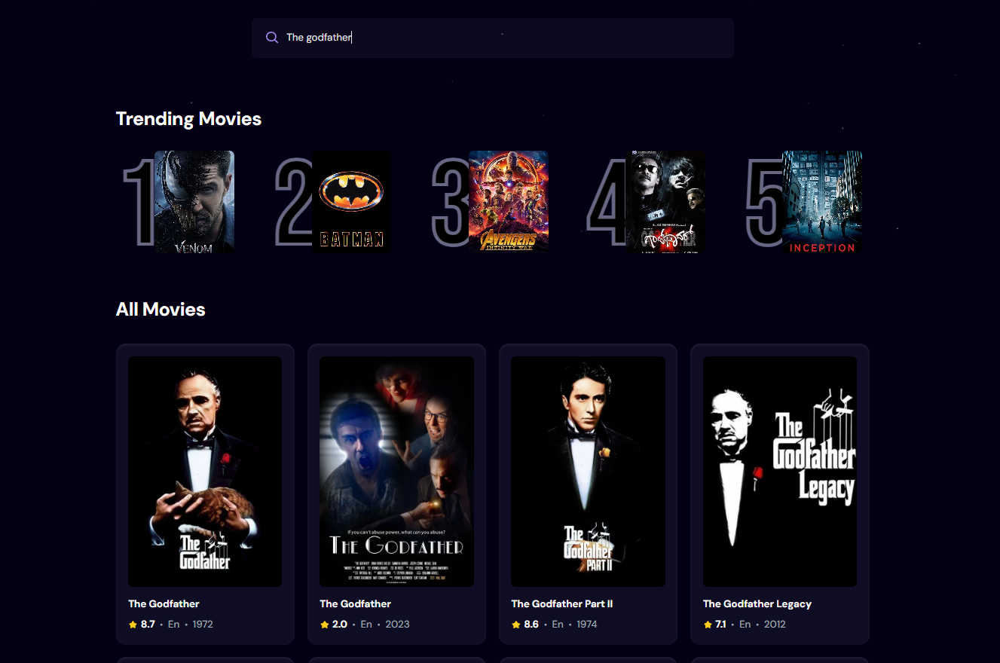
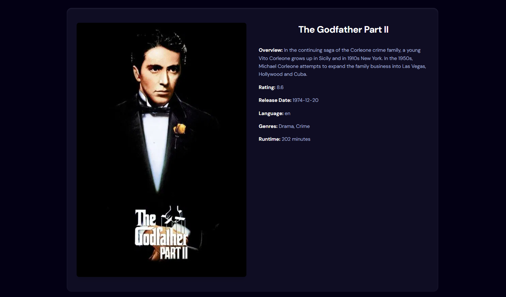

# 🎬 Movie App

A sleek and responsive **movie repository application** that allows users to explore movies from various genres and track trending search activity in real-time.

---

## 🚀 Features

- 🔍 Search movies from a vast collection via TMDB API
- 📈 View trending movie searches by users
- 🖼️ Poster and basic info for each movie
- ⚡ Fast performance with React and Tailwind CSS
- ☁️ Backend powered by Appwrite for authentication and data tracking

---

## 🛠️ Tech Stack

| Frontend |  Backend  |    Styling   |    API   |
|----------|-----------|--------------|----------|
| React JS |  Appwrite | Tailwind CSS | TMDB API |

---

## 📸 Screenshots

> Example:  
>   
> 
> 

---
